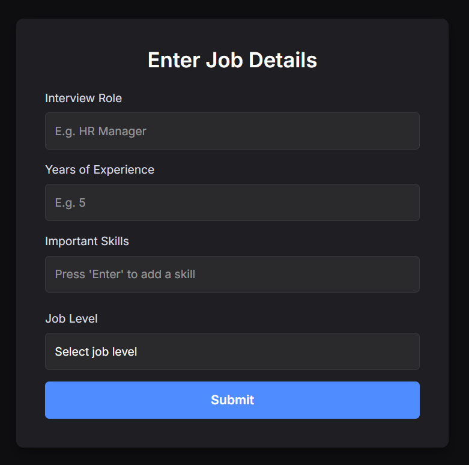
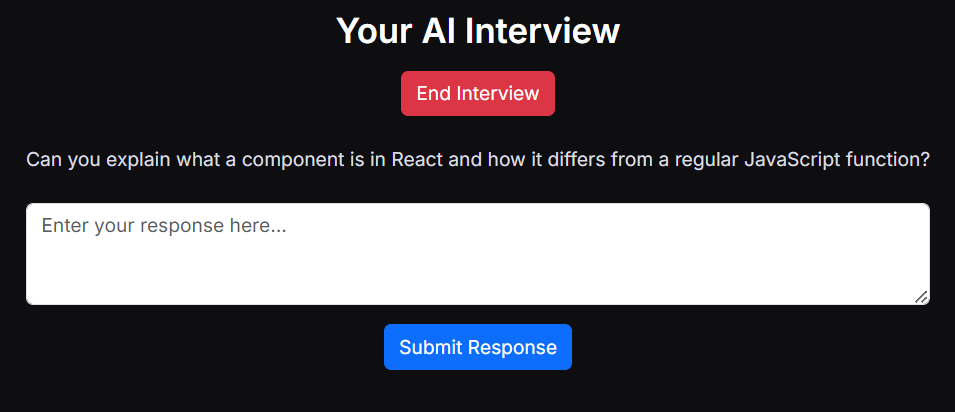

# AI Interviewer (Free-Tier Fork)

> **Project notice:** This project was created and developed by **Shreyankar Roy**. It uses a free-tier technology stack consisting of **Groq's LLM API** for question generation and the browser's built-in **Web Speech API** for speech-to-text and text-to-speech, allowing the application to run without any paid OpenAI Realtime API subscription.

## 📌 Overview

**AI Interviewer** is an AI-powered, dynamic interviewer that conducts real-time, voice-and-text interviews. It adapts its questions based on the candidate's answers and a few predefined parameters (role, experience, key skills, level).

## What this project uses

This implementation uses:

* **Backend (`app/main.py`):** FastAPI endpoints `/start_interview` and `/respond`, which communicate with **Groq's OpenAI-compatible chat completions endpoint** (`llama-3.3-70b-versatile` by default) and maintain the running interview conversation in the server-side session.
* **Frontend (`templates/interview.html`):** Uses the browser's native `SpeechSynthesis` for reading questions aloud and `SpeechRecognition` for converting the candidate's spoken answers into text.
* **Voice processing:** Speech recognition happens directly in the browser. No separate paid speech-to-text or text-to-speech API is required.
* **Text fallback:** Candidates can type their answers in browsers that do not support `SpeechRecognition`.
* **Dependencies:** The application communicates with Groq using `requests` rather than requiring the OpenAI Python package.

### ✨ Features

* 🔄 **Adaptive Questioning:** Questions adjust based on the candidate's previous answers and the initial interview parameters.
* 🎙️ **Voice or Text:** Candidates can answer using their voice through the browser's Web Speech API or type their answers manually.
* 📊 **Dynamic Evaluation:** Each answer is fed back into the conversation so the next question can build on the candidate's previous response.
* 📁 **Parameter-Based Customization:** Role, experience, key skills, and interview level influence the generated questions.
* 🧠 **AI-Powered Interviews:** Groq's LLM generates contextual interview questions dynamically.
* 🆓 **Free-Tier Friendly:** The project is designed to work with Groq's free-tier API instead of requiring a paid OpenAI Realtime subscription.
* 🌐 **Browser-Based Voice Interaction:** Uses native browser speech capabilities for interview interaction.

## 🛠️ How It Works

### 1. User Input Parameters

The candidate or recruiter provides the interview parameters:

* Job role
* Years of experience
* Key skills
* Interview level



### 2. AI-Driven Interview

The interview starts by sending the candidate's parameters to:

```text
/start_interview
```

The backend sends the interview context to Groq and generates the first interview question.

Each subsequent candidate response is sent to:

```text
/respond
```

The backend then uses the previous conversation context and the candidate's latest answer to generate the next question.

### 3. Voice Interaction

The generated interview question is read aloud using the browser's:

```javascript
speechSynthesis
```

The candidate can answer using the browser's:

```javascript
SpeechRecognition
```

The recognized speech is converted into text and sent to the backend.

A text-input fallback is also available for browsers that do not support speech recognition.



### 4. Interview Wrap-Up

After the configured number of interview questions, the system completes the interview and provides a closing response to the candidate.

## 🚀 Getting Started

### Prerequisites

Make sure the following are installed:

* Python 3.x
* pip
* A free **Groq API key**

You can create a Groq API key from the official Groq Console.

### Installation

Clone the repository:

```bash
git clone <your-repository-url>
cd ai-interviewer-realtime-version
```

Create a virtual environment:

```bash
python -m venv venv
```

Activate the virtual environment on Windows:

```bash
venv\Scripts\activate
```

On macOS/Linux:

```bash
source venv/bin/activate
```

Install the required dependencies:

```bash
pip install -r requirements.txt
```

### Configure Environment Variables

Create a `.env` file in the project root:

```env
GROQ_API_KEY=your_groq_key_here
GROQ_MODEL=llama-3.3-70b-versatile
```

Replace:

```text
your_groq_key_here
```

with your actual Groq API key.

### Run the Application

Start the FastAPI server:

```bash
uvicorn app.main:app --reload
```

The application will normally be available at:

```text
http://127.0.0.1:8000
```

Open the displayed URL in a supported web browser.

## 📂 Folder Structure

```text
ai-interviewer-realtime-version/
│
├── app/
│   └── main.py                 # FastAPI backend
│
├── static/
│   ├── input.png              # Input parameter screenshot
│   └── interview.png          # Interview interface screenshot
│
├── templates/
│   └── interview.html         # Interview frontend
│
├── tests/
│   └── ...                    # Smoke tests
│
├── requirements.txt           # Python dependencies
├── Dockerfile                 # Docker deployment configuration
├── Procfile                   # Deployment configuration
├── .env                       # Environment variables (not committed)
└── README.md                  # Project documentation
```

## 🛠️ Tools & Technologies Used

| Technology                | Purpose                                               |
| ------------------------- | ----------------------------------------------------- |
| 🐍 **Python**             | Backend programming                                   |
| ⚡ **FastAPI**             | Backend API and routing                               |
| 🌐 **HTML/CSS/Bootstrap** | Frontend user interface                               |
| 🧠 **Groq API**           | AI-powered interview question generation              |
| 🎙️ **Web Speech API**    | Browser-based speech recognition and speech synthesis |
| 📡 **Requests**           | Communication with Groq's API                         |
| 📈 **Prometheus Client**  | Basic application/request metrics                     |
| 🐳 **Docker**             | Containerized deployment                              |
| 🚀 **Procfile**           | Deployment configuration                              |

## 🔄 Interview Flow

```text
Candidate
    │
    ▼
Enter Interview Parameters
(Role / Experience / Skills / Level)
    │
    ▼
FastAPI Backend
    │
    ▼
Groq LLM
    │
    ▼
Generate Interview Question
    │
    ▼
Browser Speech Synthesis
    │
    ▼
Candidate Answers
(Voice or Text)
    │
    ▼
Browser Speech Recognition
    │
    ▼
FastAPI /respond
    │
    ▼
Groq LLM
    │
    ▼
Next Adaptive Question
    │
    ▼
Repeat Until Interview Ends
```

## 🎙️ Browser Speech Support

The project uses browser-native Web Speech APIs.

### Speech Synthesis

The AI's question is converted into speech using:

```javascript
window.speechSynthesis
```

### Speech Recognition

The candidate's spoken response is converted into text using:

```javascript
SpeechRecognition
```

or:

```javascript
webkitSpeechRecognition
```

Browser support can vary. If speech recognition is unavailable, the candidate can use the text-input option instead.

## 🔐 Environment & API Key Security

Do **not** commit your `.env` file to GitHub.

Add the following to `.gitignore`:

```text
.env
venv/
.venv/
__pycache__/
*.pyc
```

Your `.env` should remain local:

```env
GROQ_API_KEY=your_groq_key_here
GROQ_MODEL=llama-3.3-70b-versatile
```

## 🧪 Testing

Run the application's tests using:

```bash
pytest
```

For a basic application check, start the server with:

```bash
uvicorn app.main:app --reload
```

Then open the application in your browser and verify:

1. Interview parameters can be entered.
2. The interview starts successfully.
3. The first question is generated.
4. The question can be played using speech synthesis.
5. The candidate can answer using voice or text.
6. The next question is generated based on the previous answer.
7. The interview can be completed successfully.

## 🐳 Docker

The project also includes a `Dockerfile` for containerized deployment.

Build the Docker image:

```bash
docker build -t ai-interviewer .
```

Run the container:

```bash
docker run -p 8000:8000 --env-file .env ai-interviewer
```

The application can then be accessed through:

```text
http://localhost:8000
```

## 📊 Future Ideas for Enhancement

The following features can be added in future versions:

* ✅ Automatic candidate scoring against predefined evaluation metrics
* ✅ Automated interview performance analysis
* ✅ Automated report generation from interview transcripts
* ✅ Email delivery of interview reports
* ✅ Candidate performance dashboard
* ✅ Skill-wise scoring
* ✅ Interview history and database storage
* ✅ Resume-based interview question generation
* ✅ Multiple interview modes such as HR, technical, behavioral, and managerial
* ✅ More advanced voice interaction
* ✅ Support for additional languages
* ✅ Authentication and candidate accounts

## 👨‍💻 Project Author

**Shreyankar Roy**

This project was created and developed by **Shreyankar Roy** as an AI-powered interview system using a free-tier LLM and browser-native speech technologies.

### Key Contributions

* Designed and implemented the free-tier AI interview architecture.
* Integrated **Groq LLM API** for dynamic interview question generation.
* Implemented adaptive interview conversations.
* Implemented browser-based speech-to-text using the **Web Speech API**.
* Implemented browser-based text-to-speech using **SpeechSynthesis**.
* Developed the FastAPI backend endpoints.
* Developed the interview frontend and interaction flow.
* Added text-based fallback for unsupported speech-recognition browsers.
* Prepared the project documentation and deployment configuration.

## 📄 License

This project is intended for educational, research, and demonstration purposes. Add or update the license according to the terms under which you choose to distribute your project.

## ⭐ Acknowledgement

This implementation is independently developed by **Shreyankar Roy** and uses open/free-tier technologies including **Groq** and the browser's **Web Speech API**.

If you find this project useful, consider giving the repository a ⭐ on GitHub.

---

**Built by Shreyankar Roy | AI Interviewer | Groq + FastAPI + Web Speech API**
